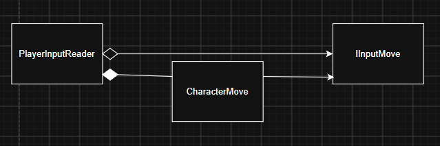

# UnityInputSystem

Unity Input System 기반 PlayerInput 설계 문서입니다.



---

## 개요

입력은 `PlayerInput` + `InputActionAsset`으로 수집하고, `PlayerInputReader`가 중앙에서 가공한 뒤 **인터페이스(폴링)** 와 **이벤트(단발)** 로 게임 로직에 전달합니다.

```
디바이스 (Keyboard / Mouse / Gamepad …)
        ↓
PlayerInputActions.inputactions  (Action Map)
        ↓
PlayerInput 컴포넌트
        ↓
PlayerInputReader  (싱글톤, 바인딩·상태·이벤트)
        ├── IInputMove / IInputCamera / IInputWheel  → CharacterMove 등 (매 프레임 폴링)
        └── OnBuildInput / OnConfirmInput            → BuildSystem 등 (이벤트 구독)
```

---

## 관련 파일

| 경로 | 역할 |
|------|------|
| `Assets/Resources/Input/PlayerInputActions.inputactions` | Action Map / Binding / Control Scheme 정의 |
| `Assets/Scripts/System/PlayerInputReader.cs` | 입력 허브 (싱글톤) |
| `Assets/Scripts/CharacterControl/InputInterfaces.cs` | 이동·카메라·휠 입력 인터페이스 |
| `Assets/Scripts/CharacterControl/CharacterMove.cs` | 이동·회전 소비 측 |
| `Assets/Scripts/CameraControl/CameraController.cs` | 카메라 팔로우·레이캐스트 |
| `Assets/Scripts/System/BuildSystem.cs` | 빌드 모드 (이벤트 연동 예정) |
| `Assets/Scripts/System/MonoSingleton.cs` | `PlayerInputReader` / `CameraController` 베이스 |

---

## 아키텍처

### PlayerInputReader

`MonoSingleton<PlayerInputReader>`이며 `IInputMove`, `IInputCamera`, `IInputWheel`을 구현합니다.

**초기화 (`Awake`)**

1. `PlayerInput`이 없으면 추가
2. `Resources.Load<InputActionAsset>("Input/PlayerInputActions")`로 에셋 할당
3. `notificationBehavior = InvokeUnityEvents`

**바인딩 (`OnEnable` / `OnDisable`)**

| Action | 콜백 시점 | 처리 |
|--------|-----------|------|
| `Player/Move` | performed, canceled | `_directionInput` 갱신 (정규화) |
| `Player/Sprint` | performed, canceled | `_sprintInput` 갱신 |
| `Player/Look` | performed, canceled | `_cameraInput` 갱신 |
| `Player/Wheel` | performed | `_wheelInput` 갱신 |
| `Player/Attack` | performed | `OnConfirmInput` 이벤트 |
| `Player/Build` | started | `OnBuildInput` 이벤트 |

연속 입력은 프로퍼티로 노출하고, 단발 입력은 `event Action`으로 발행합니다.

### 입력 인터페이스

```csharp
public interface IInputMove
{
    Vector2 Direction { get; }
    bool Sprint { get; }
}

public interface IInputCamera
{
    Vector2 CameraInput { get; }
}

public interface IInputWheel
{
    float Wheel { get; }
}
```

소비 측은 `PlayerInputReader`에 직접 의존하지 않고 인터페이스만 참조합니다.

```csharp
_moveInput = PlayerInputReader.Instance;   // IInputMove
_cameraInput = PlayerInputReader.Instance; // IInputCamera
```

### CharacterMove (소비 예)

- `Update`에서 `Direction` / `Sprint`으로 `CharacterController.Move`
- `CameraInput`으로 캐릭터 Yaw·카메라 Pitch 회전 (`rotateMultiply`, Pitch ±70° 클램프)
- `CameraController`에 팔로우 타깃·오프셋·회전 전달

### 이벤트 소비 (예정)

`BuildSystem`에 `ToggleBuildMode` / `Confirm` 스텁이 있습니다. 연결 예:

```csharp
PlayerInputReader.Instance.OnBuildInput += ToggleBuildMode;
PlayerInputReader.Instance.OnConfirmInput += Confirm;
```

> `Binding()` / `Unbinding()`에서 이벤트를 `null`로 초기화하므로, 구독은 `PlayerInputReader`가 활성화된 이후(예: 소비 측 `Start`/`OnEnable`)에 해야 합니다.

---

## Input Action Asset

경로: `Assets/Resources/Input/PlayerInputActions.inputactions`  
로드 키: `Input/PlayerInputActions`

## 데이터 흐름 요약

| 입력 종류 | 전달 방식 | 예시 |
|-----------|-----------|------|
| 연속 값 (이동, 시야, 휠, 스프린트) | 인터페이스 프로퍼티 폴링 | `CharacterMove.Update` |
| 단발 트리거 (빌드, 확인) | `event Action` | `OnBuildInput`, `OnConfirmInput` |

---

## 씬 세팅 메모

1. 씬에 `PlayerInputReader`가 붙은 오브젝트를 두거나, 없으면 `System` 태그 오브젝트에 싱글톤이 자동 생성됩니다.
2. `PlayerInputActions`는 `Resources/Input/`에 있어야 `Resources.Load`가 성공합니다.
3. 캐릭터에는 `CharacterController` + `CharacterMove`가 필요합니다.
4. `Camera.main`이 존재해야 `CameraController`가 동작합니다.

---

## 설계 포인트

- **입력과 로직 분리**: Reader는 읽기·상태만, 이동/빌드는 인터페이스·이벤트로 소비
- **폴링 + 이벤트 혼용**: 지속 입력은 폴링, 원샷은 이벤트
- **에셋 기반 바인딩**: 키 매핑 변경은 `.inputactions`에서 처리, 코드 변경 최소화
- **싱글톤 허브**: 여러 시스템이 동일 입력 소스 공유
